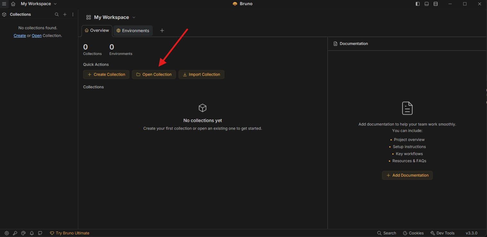
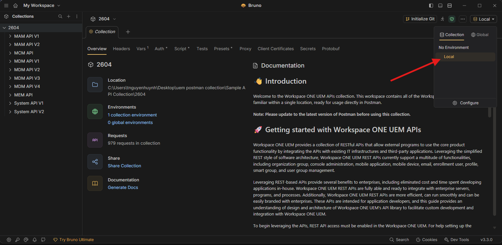

{ align=right }

Each Workspace ONE UEM tenant provides an API/help page that displays all the API commands, parameters and usage, as well as a mechanism to test each call.

## REST API reference by release

Interactive OpenAPI documentation is available per UEM REST release. Each release splits MAM, MCM, MDM, MEM, and System REST surfaces into separate specification files (one OpenAPI document per API family).

| Release | Documentation | Download |
|---------|---------------|----------|
| 2604 | [2604](versions/2604/) | [Bruno ZIP](versions/2604/uem-rest-bruno-2604.zip) |
| 2602 | [2602](versions/2602/) | [Bruno ZIP](versions/2602/uem-rest-bruno-2602.zip) |
| 2509 | [2509](versions/2509/) | [Bruno ZIP](versions/2509/uem-rest-bruno-2509.zip) |
| 2508 | [2508](versions/2508/) | [Bruno ZIP](versions/2508/uem-rest-bruno-2508.zip) |
| 2506 | [2506](versions/2506/) | [Bruno ZIP](versions/2506/uem-rest-bruno-2506.zip) |
| 2410 | [2410](versions/2410/) | [Bruno ZIP](versions/2410/uem-rest-bruno-2410.zip) | 

For each major UEM release, a **Bruno** collection is available as a ZIP in the [REST API reference by release](#rest-api-reference-by-release) table. The collection includes the same API surfaces as the published OpenAPI documents, with environments you can fill in for your tenant.

## Getting started with the Bruno collection

You can be up and running in a few minutes: download the archive for your release, open it in **Bruno**, select an environment, and set the variables for your UEM tenant.

### Open the collection in Bruno

1. Download the **Bruno ZIP** for the UEM release you use (see the [table above](#rest-api-reference-by-release)).
2. Extract the archive, then in Bruno choose **Open Collection** and select the collection folder (the one that contains `bruno.json` if present), or open the folder you use for that release.
   
3. In the **Environments** list, select the environment that matches your use case (for example a local or example environment). The collection ships with **variable placeholders** for OAuth and API host values—open the environment editor to see and edit them.
   

### Collect Environment Variable Values
Before making the first API call, you must collect these five items:

- aw-tenant-code (API key)
- REST API URL
- Oauth token URL
- Oauth client ID
- Oauth client secret

#### aw-tenant-code and REST API URL

To get these first two values, follow these steps:

1. In the Workspace ONE UEM admin console, navigate to **Groups and Settings** > **All Settings** > **System** > **Advanced** > **API** > **Rest API**. Make sure you’re in Customer OG or below.
2. Copy the API key and hostname part of the REST API URL (e.g. as2060).  
   
3. Back in Bruno, add these values in the **environment** for the collection (variable names may match `YOUR_API_SERVER`, `aw-tenant-code`, or similar—use the names your Bruno environment defines):
   1. YOUR_API_SERVER
   2. Aw-tenant-code  
   

#### OAuth token URL

See the [Datacenter and Token URLs](https://docs.omnissa.com/bundle/WorkspaceONE-UEM-Console-BasicsVSaaS/page/UsingUEMFunctionalityWithRESTAPI.html#datacenter_and_token_urls_for_oauth_20_support) KB and copy the Token URL for your region.

**Note:** You might also want to create a dedicated REST API admin role for your environment, which is described in that same article. The example in this brief guide does not cover a dedicated REST API admin role, and uses the console admin role instead.

#### OAuth client ID and client secret

In Workspace ONE UEM admin console, follow these steps.

1. Navigate to **Group & Settings** > **Configurations** > **OAUTH client management** and click **Add**.  
   
   
2. Copy the client ID and secret to a text file.  
   
   Finally, you must obtain a fresh API token.
3. Configure **OAuth2** (or the collection’s auth flow) on the **collection or folder**: run **Get access token** or the equivalent for client credentials, depending on how the Bruno collection is set up.  
   

Now that you have successfully authenticated to Workspace ONE UEM, you have unlocked the access to all the API calls included in the collection.

### Real-World Example: Find Devices and Apply Tag

Let's see how to achieve this simple goal without touching the UEM console: find Windows devices for user Wannes and apply a tag to those devices. 

First, start with a request that returns the devices you are looking for. The API call `{{baseUrl}}/mdm/devices/`search sounds like the correct one.

To find out the purpose of a specific API call, see the documentation section. You will find a short description and additional details for mandatory and optional parameters.


1. Copy the values of the `LocationGroupId` and device `Id` (located near the end) attributes in the response body, you will use these values later.
2. The next step would be to obtain the available tags from UEM. This requires the following API: `{{baseUrl}}/system/groups/:id/tags`, which is located under System API V1 > Tags.
   In the documentation section of this API, the PATH variable mentioned is mandatory, so the Organization Group ID value obtained with the previous call needs to be added to the Params tab.  
   
3. In the response body, you will find the available tags for the given Organization Group. Note down the Id value of the tag, you will need it for the final API call to assign a tag.
   Lastly, execute the API call that applies the selected tag to the device, using `{{baseUrl}}/mdm/tags/:tagid/`adddevices, located in MDM API V1 > Tags.
4. As shown in Bruno, the tag ID is a mandatory value. Enter the tag ID from the previous call in the request **Params** (or path variables).  
   
5. In the Body tab, add the device ID obtained with the first API call.  
   
6. Click send and check the UEM console for the result.  
   

### Error Handling

In case of an error, review **response** output and any **script / console** output Bruno shows for the request.


### Additional Considerations

Now that you know which API calls to use to reach our goal, you can proceed to automate the process if needed. Bruno can **generate code snippets** for requests in several languages from the request view, where supported.


Below is a real-world example of a script built for a customer. In short, it does the following things:

1. Retrieves all available tags in a specific Organization Group.
2. Retrieves all devices enrolled in the last X number of days.
3. Checks the first five characters of the Asset Number that the user entered during enrollment.
4. If it can find a tag that matches these 5 characters, that tag is assigned. If no match is found, a fallback tag is assigned.

These tasks that are not natively available in the Workspace ONE UEM console, but can easily be tackled using the REST APIs described here (client examples below use PowerShell; adapt as needed for your toolchain).

```js
################################################################################## Parameters

#################################################################################

# Define the OAuth endpoint, client ID, and client secret

$tokenUrl = "<provide Token URL>"

$clientId = "<provide Oauth Client ID>"

$clientSecret = "<provide Oauth Client Secret>"

$api_server_url = "<provide API Server hostname (asXXXX)>"

$aw_tenant_code = "<provide API key>"

$LocationGroupID = "<LG_ID>"

$numberOfDays = 1

 

#################################################################################

# request token

#################################################################################

# Define the OAuth request parameters

$body = @{

    grant_type    = "client_credentials"

    client_id     = $clientId

    client_secret = $clientSecret

}

 

# Make the OAuth token request

$oauth_token = Invoke-RestMethod -Uri $tokenUrl -Method Post -ContentType "application/x-www-form-urlencoded" -Body $body

 

#################################################################################

# Get available tags in given Organization group

#################################################################################

$headers = New-Object "System.Collections.Generic.Dictionary[[String],[String]]"

$headers.Add("Accept", "application/json;version=1")

$headers.Add("Authorization", "Bearer $($oauth_token.access_token)")

 

$availableTags = Invoke-RestMethod "https:// $api_server_url.awmdm.com/api/system/groups/$LocationGroupID/tags" -Method 'GET' -Headers $headers

 

# Store tags in a dictionary for fast lookup

$tagDict = @{}

foreach ($tag in $availableTags.Tags) {

    $tagDict[$tag.TagName] = $tag

}

 

# Add the special tag for empty or invalid asset numbers

$emptyOrInvalidTagName = "emptyorinvalidassetnumber"

$emptyOrInvalidTagID = $tagDict[$emptyOrInvalidTagName].Id

 

#################################################################################

# get devices enrolled in the last X days

#################################################################################

$startDate = (Get-Date).AddDays(-$numberOfDays).ToString("yyyy/MM/dd")

 

$recentlyEnrolled = Invoke-RestMethod "https:// $api_server_url.awmdm.com/api/system/users/enrolleddevices/search?enrolledsince=$startDate" -Method 'GET' -Headers $headers

 

#################################################################################

# Match AssetNumber (first 5 characters) with TagName and assign tag

#################################################################################

 

foreach ($device in $recentlyEnrolled.EnrolledDeviceInfoList) {

    $tagID = $null

    if (![string]::IsNullOrEmpty($device.AssetNumber) -and $device.AssetNumber.Length -ge 5) {

        $assetNumberPrefix = $device.AssetNumber.Substring(0, 5)

        if ($tagDict.ContainsKey($assetNumberPrefix)) {

            $tagID = $tagDict[$assetNumberPrefix].Id

        }

    }

   

    # If no matching tag found, use the emptyOrInvalidTagID

    if ($null -eq $tagID) {

        $tagID = $emptyOrInvalidTagID

    }

 

    $deviceID = $device.DeviceID

 

    $body = @{

        BulkValues = @{

            Value = @($deviceID)

        }

    } | ConvertTo-Json -Compress

 

    $response = Invoke-RestMethod "https:// $api_server_url.awmdm.com/api/mdm/tags/$tagID/adddevices" -Method 'POST' -Headers $headers -Body $body

 

    # Output the response for each device

    $response | ConvertTo-Json

}
```